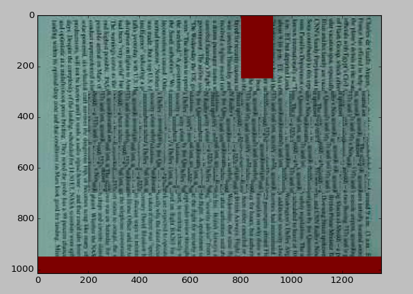

# eecs432_magic-eraser
"Magic Eraser" final project, co-authored by Lauren Hutson and William Spies, MSR 2017-2018 Cohort at Northwestern University 

----------------
### Changes made: 
#this branch was made so i dont accedentally overwrite something important

in magic eraser.py the function call was changed from 

imageTiling.processimage(frame_blankedImage, frame_height, frame_width, tilesize=100, overlapwidth=25)

to 

frame_erasedImage = imageTiling.processimage(frame_blankedImage,  frame_height, frame_width,tilesize=20, overlapwidth=10)

- the smaller frame size in the video compared to the png i was using for testing made the program try to pull values that are outside of the array size. 
- the .sizevalues for the height and width are also opposite between your code and mine

in imagetyling.py

- the threashhold of acceptable ssd values was lowered from 1.5M to 1.2M based on the data gathered from the still image generated from magiceraser. This is subject to change once the full video is being tested 

-when checking for a pixel of value (255,255,255) chaned the code to look at all 3 channels of color before deciding to skip the pixel or continue with ssd
     - this prevents the program from accedentally finding blue frames and tiling over them

----------------

# Instructions on how to use tiling function
----------------
### Function call : 
processimage (im,framewidth,frameheight,tilesize,overlapwidth)
----------------
### Returns: 
im - processed frame from the video
----------------

1) im = the frame gotten from the video
	- the area that you want to be tiled over needs to be of color (255,255,255)
	- the pen and the graphical error at the bottom of the frames should be overlayed with the color 
	(0,0,255) otherwise tile samples with portions of these can be used to fill in the blank area

2) framewidth = the width in pixels of the frame

3) frameheight = the height in the pixels of the frame

4) tilesize = the size of the tile added to the empty space
	
	- If the size is too large then when tiling happens there is a chance that the tile will exceed the frame size
	- If the size is too small then it will take a long time to run
5) overlapwidth = the amount of overlap between the frame and the tile when checking the similarity between the neighboring frames
	
unprocessed image: 

processed image:

original image:

